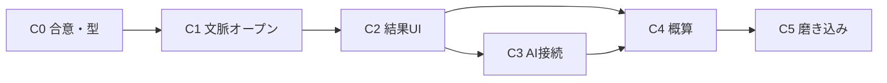

# AIコンシェルジュ — 実装プラン

最終更新: 2026-07-10  
設計本体: [`AI_CONCIERGE_REDESIGN.md`](./AI_CONCIERGE_REDESIGN.md)  
サイト体験: [`SITE_EXPERIENCE_IMPLEMENTATION_PLAN.md`](./SITE_EXPERIENCE_IMPLEMENTATION_PLAN.md)

## 方針

- **一気にLLM接続しない** — 文脈オープンと結果UIを先に固める
- **現行の選択式フローは残す** — `ideal-flow.ts` を入口として拡張
- **金額はルールエンジン** — AIは分類・説明のみ（後Phase）
- **既存の open-bridge / contact-prefill を壊さない** — オプション拡張で進める
- サイト体験 Phase 1〜5 完了後の **横断導線強化** として位置づける

---

## フェーズ概要

| Phase | 目的 | 期間目安 | LLM | 成果物 |
|-------|------|----------|-----|--------|
| **C0** | 合意・型定義 | 0.5日 | なし | 本ドキュメント確定、PageContext 型 ✅ |
| **C1** | 文脈オープン | 1〜2日 | なし | pathname→文脈、第一声、初期選択肢 ✅ |
| **C2** | 結果UI化 | 1〜2日 | なし | ConciergeResult カード、関連デモ導線 ✅ |
| **C3** | AI接続（整理） | 2〜4日 | あり | 自由入力・追加質問・要件ドラフト |
| **C4** | 概算 | 1〜2日 | 分類のみ可 | 価格ルール + 表示 + Contact引き継ぎ ✅ |
| **C5** | 磨き込み | 1〜2日 | — | 全主要ページの文脈カバー、営業デモ用導線 |

**実装済み（2026-07-10）: C0〜C2, C4。** 次は C3（AI接続）または C5（磨き込み）。

**推奨着手順: C0 → C1 → C2 → C3 → C4。**  
C1 だけでも「サイト横断の案内役」感が出る。C3 前に C2 を入れると、AI出力の見せ場が先に決まる。

---

## Phase C0 — 合意・型定義

### やること

- [ ] [`AI_CONCIERGE_REDESIGN.md`](./AI_CONCIERGE_REDESIGN.md) の3役割・ハイブリッド方針を確認
- [ ] PageContext / ConciergeResult の型を `lib/concierge/` に置く方針を確定
- [ ] 「金額はルールのみ」をチーム合意

### やらないこと

- API Route や LLM プロバイダ接続
- 完了画面の全面リライト（C2）

### 成果物（型の置き場案）

```
lib/concierge/
  page-context.ts      # ConciergePageContext 型 + resolvePageContext(pathname)
  context-openings.ts  # pageType / id ごとの第一声・初期アクション
  types.ts             # ConciergeResult 等（新規 or 分割）
```

---

## Phase C1 — 文脈オープン（最優先・LLMなし）

### 目的

コンシェルジュを開いた瞬間に、**今見ているページに応じた第一声と初期選択肢**を出す。

### 現状

- `openConcierge({ serviceHint })` のみ
- FAB は文脈なしで root 選択から開始
- デモ・Cases・記事からは文脈が渡らない

### 実装方針

1. **`resolvePageContext(pathname)`**  
   ルールベースで `pageType` / `demoId` / `caseSlug` / `serviceId` 等を解決する。

2. **Context Registry（データ）**  
   主要パスとオープニング定義をデータ化する。

   | マッチ例 | pageType | 付随ID |
   |----------|----------|--------|
   | `/` | home | — |
   | `/ai-capability-gallery` | demo_hub | — |
   | `/ai-capability-gallery/[slug]` | demo | capabilities の slug |
   | `/services/web-development` 等 | service | serviceId |
   | `/cases/industries/[slug]` | case | caseSlug |
   | `/lab`, `/lab/insights/[slug]` | lab / insight | insightSlug |
   | その他 | other | — |

3. **open API の拡張**

   ```ts
   // 現行互換を維持しつつ拡張
   type OpenConciergeBridgeOpts = {
     serviceHint?: string
     /** 明示指定。省略時は pathname から解決 */
     pageContext?: ConciergePageContext
   }
   ```

   - Provider 内で `usePathname()` を使い、opts 未指定時は自動解決
   - FAB オープン時も自動で PageContext 付与

4. **フロー入口の分岐**

   - `demo` / `case` / `service` 等: **Context Opening ステップ**（第一声 + アクション選択）
   - アクション後: 既存の track 質問へ、または専用ショートカット（例: 「概算」は C4 までプレースホルダ可）
   - `home` / `other`: 現行 root 選択のまま

5. **デモページCTA**  
   Gallery / 各デモ / Cases の CTA から `OpenConciergeButton` を文脈付きで呼べるようにする（自動 pathname 解決でも可）。

### 主なファイル（予定）

| 操作 | ファイル |
|------|----------|
| 新規 | `lib/concierge/page-context.ts` |
| 新規 | `lib/concierge/context-openings.ts` |
| 改修 | `lib/concierge/open-bridge.ts` |
| 改修 | `components/concierge/concierge-context.tsx` |
| 改修 | `components/concierge/IdealConciergeFlow.tsx` |
| 改修 | `components/concierge/ConciergeRoot.tsx` |
| 任意 | `OpenConciergeButton` / Gallery・Cases CTA |

### 受け入れ条件

- [ ] `/ai-capability-gallery/voice-to-structured` で開くと、音声→構造化に言及する第一声が出る
- [ ] `/services/web-development` で開くと Web 向け初期選択肢が出る（または web track へ）
- [ ] `/cases/industries/construction-photo-sorting` で開くと建設・写真整理に言及する
- [ ] 文脈不明ページでは現行 root 選択にフォールバック
- [ ] 既存の `serviceHint` 起動が壊れていない

### やらないこと（C1）

- LLM API
- 概算計算
- 完了画面の全面UI刷新（最低限、第一声のみで可）

---

## Phase C2 — 結果UI化

### 目的

完了画面を Markdown の壁から、**相談整理カード**にする。

### 実装方針

1. **`buildConciergeResult(track, answers, pageContext)`**  
   構造化オブジェクトを返す（現行 `buildIdealSummaryMarkdown` は Contact 用テキスト生成に残すか、結果から生成に変更）。

2. **`ConciergeDoneStep` をブロックUIに**

   - 現在の状況
   - 希望時期
   - おすすめの方向性
   - 想定機能（タグ）
   - 関連デモ（`capabilities` / Cases から1〜2件）
   - 次のステップCTA: 相談する / サービスを見る /（後で）概算・要件を深める

3. **関連デモの紐づけ**  
   track + situation + pageContext.demoId から、静的マップで関連デモを返す（C3 前はルールのみで十分）。

### 主なファイル（予定）

| 操作 | ファイル |
|------|----------|
| 新規/改修 | `lib/concierge/build-summary.ts` → result builder 分割可 |
| 新規 | `lib/concierge/related-content.ts` |
| 改修 | `components/concierge/ConciergeDoneStep.tsx` |
| 改修 | `lib/concierge/contact-prefill.ts`（構造化をメッセージに反映） |

### 受け入れ条件

- [ ] 完了画面に状況・方向性・次のステップがセクションとして見える
- [ ] 関連デモへのリンクが少なくとも1件出る（該当時）
- [ ] 「お問い合わせへ（内容を引き継ぐ）」が従来どおり動く

---

## Phase C3 — AI接続（要件整理）

### 目的

自由入力と少数の追加質問で、**簡易要件定義ドラフト**を生成する。

### 実装方針

1. **API Route**（例: `app/api/concierge/chat/route.ts`）  
   - 入力: PageContext + これまでの回答 + ユーザー発話  
   - 出力: 次の質問 or 構造化 ConciergeResult の差分  
   - システムプロンプトで「金額を断定しない」「idealのデモ/サービスに誘導する」を固定

2. **UI**  
   - 選択フロー後（または Context Opening の「自由に書く」）にテキスト入力  
   - AI追加質問は最大3〜5問で打ち切り  
   - 結果は C2 のカードUIに流し込む

3. **安全**  
   - レート制限・タイムアウト  
   - 失敗時はテンプレート結果（現行相当）にフォールバック  
   - キーはサーバーのみ

### やらないこと（C3）

- 金額の生成（C4のルールへ委譲。プロンプトでも禁止）
- 長期会話履歴DB（まずはリクエスト単位 / sessionStorage 程度）

### 受け入れ条件

- [ ] 「写真整理が大変」系の自由入力で、関連デモ案内 + 追加質問が返る
- [ ] 最終結果が ConciergeResult カードに載る
- [ ] API障害時も選択式のみで Contact まで到達できる

---

## Phase C4 — 概算（ルールベース）

### 目的

相談内容から参考価格レンジを出し、Contact に引き継ぐ。

### 実装方針

1. **`data/concierge/pricing-rules.ts`（または `lib/concierge/estimate.ts`）**  
   行項目ID・ラベル・min/max・適用条件（track / 機能タグ）。

2. **セレクタ**  
   - 第一段: ルール（track + 想定機能タグ）  
   - 任意: AIが「候補行項目ID」だけ返す → ルールで合算（金額自体はAIに出させない）

3. **UI**  
   - 完了画面または「概算費用を算出する」ステップ  
   - レンジ表示 + 内訳（どの行を足したか）+ 変動注記

4. **Contact**  
   - prefill に概算レンジと内訳テキストを追加

### 受け入れ条件

- [x] 同じ入力なら同じレンジが出る（決定的）— `buildConciergeEstimate`
- [x] 注記が必ず表示される — `ESTIMATE_DISCLAIMER` / `ConciergeEstimateBlock`
- [x] AIレスポンスに単独の金額数字を採用しない — 金額は `pricing-rules.ts` のみ

### 実装結果（2026-07-10）

| ファイル | 役割 |
|----------|------|
| `lib/concierge/pricing-rules.ts` | 行項目・レンジ・注記 |
| `lib/concierge/estimate.ts` | 行選定 + 合算 |
| `components/concierge/ConciergeEstimateBlock.tsx` | 概算UI |
| `ConciergeDoneStep` | 「概算費用を算出する」→ 表示 → Contact引き継ぎ |

---

## Phase C5 — 磨き込み・営業デモ化

### やること

- [ ] 主要デモ7本・公開Cases・主要サービス3つのオープニング文面を揃える
- [ ] TOP / Gallery CTA コピーを「自社でも使えるか相談」に寄せる
- [ ] 営業用シナリオ（デモ1本 → コンシェルジュ → 要件 → 概算 → Contact）を1本ドキュメント化
- [ ] モバイルでのパネル高さ・キーボードとの干渉確認

### 任意

- LAB Insights からの文脈オープン精緻化
- 「AIコンシェルジュ型サイト」を SERVICES / LAB で短く紹介するセクション

---

## 依存関係



C4 は C3 なしでも「選択結果→ルール概算」だけで先行可能。  
ただし **結果UI（C2）がある方が概算の見せ場が安定**する。

サイト体験プランとの関係:

- DEMOS / CASES / SERVICES が揃っているほど、文脈オープンと関連コンテンツ案内が効く
- URL変更（サイト体験 Phase 6）時は `resolvePageContext` のルールを同時更新

---

## 既存資産の拡張マップ

| 資産 | 現状 | 拡張後 | Phase |
|------|------|--------|-------|
| `ideal-flow.ts` | root + situation + timeline | 維持。Context Opening の後段に接続 | C1 |
| `serviceHint` | サービスIDのみ | PageContext の一部として互換維持 | C1 |
| `buildIdealSummaryMarkdown` | Markdown要約 | Contact用テキスト生成 or Resultから生成 | C2 |
| `ConciergeDoneStep` | テキスト + 2ボタン | 構造化カード + 関連デモ + 次ステップ | C2 |
| `contact-prefill` | 選択内容の下書き | 要件ブロック + 概算を追加 | C2, C4 |
| `OpenConciergeButton` | serviceId | 省略時は pathname 文脈（Provider側） | C1 |
| `capabilities` / Cases data | ギャラリー・事例 | related-content の参照元 | C2 |

---

## リスクと対策

| リスク | 対策 |
|--------|------|
| 文脈ルールのメンテ漏れ | Registry を1ファイルに集約。デモ追加時チェックリスト化 |
| LLMコスト・品質 | C1/C2を先に価値出す。C3は質問数上限 |
| 見積もり炎上 | ルールのみ・注記必須・「正式見積ではない」をUIに固定 |
| FABが邪魔 | 既存パネルUXを維持。文脈は中身だけ変える |
| サイト体験と二重管理 | オープニング文は短く、詳細コピーは各ページに任せ案内に徹する |

---

## 直近の次アクション

1. 完了画面で「概算費用を算出する」→ 内訳・注記・Contact引き継ぎを目視確認
2. 価格表（`pricing-rules.ts`）のレンジを実案件に合わせて調整
3. **C3** AI接続、または **C5** 磨き込みへ
