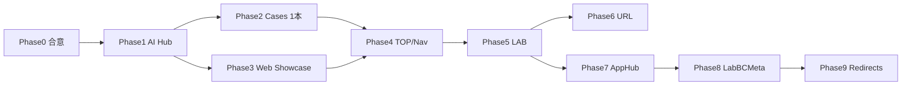

# ideal サイト体験再設計 — 実装プラン

最終更新: 2026-07-10  
設計本体: [`SITE_EXPERIENCE_REDESIGN.md`](./SITE_EXPERIENCE_REDESIGN.md)  
導線監査: [`UX_AUDIT.md`](./UX_AUDIT.md) / E2E: [`e2e/`](../e2e/)

## 方針

- **一気に全ページ作り直さない**
- **URL変更は後回し**（中身の役割とナビを先に変える）
- **既存UI資産は再配置**（モーダル・タブ・モーション・長文）
- 既に完成度の高い `/ai-capability-gallery` を DEMOS の核として活用

---

## フェーズ概要

| Phase | 目的 | 期間目安 | 成果物 |
|-------|------|----------|--------|
| **0** | 合意・ナビ仮置き | 0.5日 | 本ドキュメント確定、Header ラベル案 |
| **1** | AI を Hub 化 | 2〜4日 | `/services/ai-consulting` 再構成 |
| **2** | Cases の型を1本 | 2〜3日 | `/cases` + 建設写真整理 1本 |
| **3** | Web を体験型に | 3〜5日 | `/services/web-development` 再構成 |
| **4** | TOP / ナビ整備 | 1〜2日 | TOP導線、Header/Footer |
| **5** | LAB へ退避 | 2〜3日 | Insights 化、Philosophy 導線整理 |
| **6** | URL整理（任意） | 1〜2日 | `/demos` `/lab` 等への移行 |
| **7** | App Hub 化 | 3〜5日 | `/services/app-development` 操作体験型 |
| **8** | BC/Meta LAB 再配置 | 2〜4日 | `/lab/blockchain` `/lab/metaverse` |
| **9** | BC/Meta redirect | 0.5〜1日 | 旧サービスURL → LAB |

---

## Phase 0 — 合意（実装前）

### やること

- [ ] [`SITE_EXPERIENCE_REDESIGN.md`](./SITE_EXPERIENCE_REDESIGN.md) の4分類・導線をチームで確認
- [ ] Phase 1〜3 の優先順位を確定（本プランどおりで進める）
- [ ] 「削除しない / 再配置する」リストを共有

### やらないこと

- 大規模なファイル削除
- 全サービスページの同時リライト

---

## Phase 1 — AI Capability Hub 化（最優先）✅ 完了 (2026-07-10)

### 目的

説明ページだった `/services/ai-consulting` を、**デモへ誘導する Hub** にする。

### 実装結果

1. **Hero** — Gallery と同系コピー + 主CTA `/ai-capability-gallery`
2. **セクション** — 7変化 / 注目3本 / 業界 / 課題 / 進め方 / 技術詳細(アコーディオン) / FAQ / CTA
3. **退避** — [`docs/lab-insights-drafts/AI_PAGE_RETIRED_SECTIONS.md`](./lab-insights-drafts/AI_PAGE_RETIRED_SECTIONS.md)

### 主なファイル

- [`app/services/ai-consulting/page.tsx`](../app/services/ai-consulting/page.tsx)
- [`data/services/ai-hub.ts`](../data/services/ai-hub.ts)
- [`components/services/ai-hub/`](../components/services/ai-hub/)

---

## Phase 2 — Cases 型を1本作る ✅ 完了 (2026-07-10)

### 目的

「課題 → 解決フロー → デモ → 相談」の型を確立する。

### 実装結果

1. **ルート**
   - `/cases`（一覧）
   - `/cases/industries/construction-photo-sorting`（建設 × 現場写真整理）
2. **構成** — Hero / Before・After フロー / デモCTA / 相談CTA
3. **導線** — AI Hub「業界で見る」建設 → Case、Gallery と写真デモから Cases へ

### 主なファイル

- [`data/cases/`](../data/cases/)
- [`components/cases/`](../components/cases/)
- [`app/cases/`](../app/cases/)

---

## Phase 3 — Web ページを Interaction Showcase 化 ✅ 完了 (2026-07-10)

### 目的

`/services/web-development` を「Web制作技術を体験するページ」にする。

### 実装結果

1. **Hero** — マウス追従グロー1つ + 「見るだけではなく、触れたくなるWebを。」
2. **Interaction Showcase** — Modal / Motion / Interaction を実際に触らせる
3. **What we build** — コーポレート / LP / 業務Web
4. **Under the Hood** — 技術カード + 「このサイトでの使用」付きモーダル
5. **退避** — [`docs/lab-insights-drafts/WEB_PAGE_RETIRED_SECTIONS.md`](./lab-insights-drafts/WEB_PAGE_RETIRED_SECTIONS.md)

### 主なファイル

- [`app/services/web-development/page.tsx`](../app/services/web-development/page.tsx)
- [`data/services/web-hub.tsx`](../data/services/web-hub.tsx)
- [`components/services/web-hub/`](../components/services/web-hub/)

---

## Phase 4 — TOP とグローバルナビ ✅ 完了 (2026-07-10)

### 目的

入口を「触る・頼む」に寄せ、DAOを奥へ。

### 実装結果

1. **Header** — トップ / デモ / 事例 / サービス(Web·AI·アプリ) / LAB / 問い合わせ
2. **Footer** — 体験する / サービス / LAB の目的別リンク
3. **TOP** — Hero（デモCTA）→ DemoEntryBanner → サービス3つ → Cases予告 → LabTeaser → CTA
4. **DAOOverview / TwoCard（DAO対IT）** — TOPから外し、LAB へ控えめ導線

### 主なファイル

- [`components/layout/Header.tsx`](../components/layout/Header.tsx)
- [`components/layout/Footer.tsx`](../components/layout/Footer.tsx)
- [`app/page.tsx`](../app/page.tsx)
- [`components/sections/DemoEntryBanner.tsx`](../components/sections/DemoEntryBanner.tsx)
- [`components/sections/LabTeaser.tsx`](../components/sections/LabTeaser.tsx)

---

## Phase 5 — LAB への再配置 ✅ 完了 (2026-07-10)

### 目的

旧長文・研究・BC/Metaverse の深掘りを LAB に集約。

### 実装結果

1. **`/lab`** — LAB ハブ（Philosophy / Research / Insights / BC / Metaverse）
2. **Insights 4本** — `/lab/insights` + 各 slug（AI比較・3要素・なぜ今・働き方）
3. **BC / Metaverse** — SERVICES に実務を残し、`LabServiceCallout` で LAB へ誘導
4. **ナビ** — Header LAB → `/lab`、Footer LAB 欄に Insights 追加
5. **既存URL維持** — `/philosophy` `/research` は残し、LAB パンくずを追加（Phase 6 で redirect 可）

### 主なファイル

- [`app/lab/`](../app/lab/)
- [`data/lab/`](../data/lab/)
- [`components/lab/`](../components/lab/)
- [`components/sections/LabServiceCallout.tsx`](../components/sections/LabServiceCallout.tsx)

---

## Phase 6 — URL 整理（任意・後回し）

条件: Phase 1〜5 が安定してから。

- `/ai-capability-gallery` → `/demos/ai-capability-gallery`（redirect）
- `/philosophy` → `/lab/philosophy`
- `/research` → `/lab/research`
- `/services/ai-consulting` → `/services/ai`

`next.config.ts` の redirects で対応。SEO・外部リンクを壊さない。

---

## Phase 7 — App Hub 化 ✅ 完了 (2026-07-10)

### 目的

`/services/app-development` を「Webアプリ・業務ツール」の**操作体験型 Hub** に再定義する。

### 実装結果

1. **Hero** — 「入力する。処理する。結果が返る。」/ 業務を、動く仕組みに。
2. **Product Showcase** — 入力→処理→結果 / ステータス管理 / ダッシュボード＋モバイル
3. **What we build / 課題→仕組み / 関連デモ / 進め方 / Under the Hood**
4. **ラベル統一** — Header/Footer/TOP を「Webアプリ・業務ツール」に
5. **serviceNavLinks** — Web / AI / アプリの3本化（BC/Meta 除外）
6. **退避** — [`docs/lab-insights-drafts/APP_PAGE_RETIRED_SECTIONS.md`](./lab-insights-drafts/APP_PAGE_RETIRED_SECTIONS.md)

### 主なファイル

- [`app/services/app-development/page.tsx`](../app/services/app-development/page.tsx)
- [`data/services/app-hub.tsx`](../data/services/app-hub.tsx)
- [`components/services/app-hub/`](../components/services/app-hub/)

---

## Phase 8 — BC / Metaverse LAB 再配置 ✅ 完了 (2026-07-10)

### 目的

BC / Metaverse を「売りのサービス」から外し、研究・実験の見せ場として LAB に集約。

### 実装結果

1. **`/lab/blockchain`** — Philosophy / Research Topics / Experiments / Soft CTA
2. **`/lab/metaverse`** — Categories / Projects / Technology / Soft CTA
3. **サービスページ薄化** — `/services/blockchain-development` `/services/metaverse` を LAB ブリッジに
4. **lab hub / labNavLinks** — BC/Meta のリンクを `/lab/*` に更新
5. **退避** — BLOCKCHAIN / METAVERSE の retired sections メモ

### 主なファイル

- [`app/lab/blockchain/page.tsx`](../app/lab/blockchain/page.tsx)
- [`app/lab/metaverse/page.tsx`](../app/lab/metaverse/page.tsx)
- [`data/lab/blockchain.ts`](../data/lab/blockchain.ts)
- [`data/lab/metaverse.ts`](../data/lab/metaverse.ts)
- [`components/lab/LabAreaViews.tsx`](../components/lab/LabAreaViews.tsx)
- [`components/lab/LabServiceBridge.tsx`](../components/lab/LabServiceBridge.tsx)

---

## Phase 9 — BC/Meta redirect ✅ 完了 (2026-07-10)

### 目的

旧サービス URL を LAB へ permanent redirect。リンク総点検。

### 実装結果

1. **redirects** — `/services/blockchain-development` → `/lab/blockchain`
2. **redirects** — `/services/metaverse` → `/lab/metaverse`
3. **redirects** — `/services/dao-design` → `/lab/blockchain#dao-governance`
4. **リンク更新** — relatedServices、services-overview、ServiceGridSection、ai.tsx 等

### 主なファイル

- [`next.config.ts`](../next.config.ts)
- [`data/services/service-links.ts`](../data/services/service-links.ts)

---

## 依存関係

Cases と Web は並列可能。AI Hub を先にすると導線が作りやすい。

---

## 既存資産の再配置マップ（実装チェックリスト）

| 資産 | 現状 | 行き先 | Phase |
|------|------|--------|-------|
| AI Gallery + ショーケース | `/ai-capability-gallery` | DEMOS 核（維持〜昇格） | 1, 4 |
| AI 長文セクション | `ai-consulting` | LAB Insights | 1, 5 |
| Web 技術モーダル | `web-development` | Under the Hood | 3 |
| ページ遷移 / HeroReveal | 全体 | 維持（待ち方最適化済み） | — |
| Philosophy / Research | `/philosophy` `/research` | LAB | 4, 5 |
| BC / Metaverse 詳細 | `/lab/blockchain` `/lab/metaverse` | LAB 専用ページ + redirect | 8, 9 |
| App 長文セクション | `app-development` | Product Showcase + Under the Hood | 7 |
| Concierge / Contact | 全体 | CTA として維持 → 文脈型コンシェルジュへ拡張 | 全Phase → 別プラン |

コンシェルジュの本格拡張（ページ文脈オープン・要件整理・概算）は次を参照:

- 設計: [`AI_CONCIERGE_REDESIGN.md`](./AI_CONCIERGE_REDESIGN.md)
- 実装: [`AI_CONCIERGE_IMPLEMENTATION_PLAN.md`](./AI_CONCIERGE_IMPLEMENTATION_PLAN.md)

---

## リスクと対策

| リスク | 対策 |
|--------|------|
| 範囲が広がりすぎる | Phase 1→2→3 の順を守る。6は任意 |
| 全部動いて安っぽくなる | モーション配分ルールを Phase 3 で厳守 |
| URL変更でリンク切れ | Phase 6 まで現行URL維持 |
| Cases がデモと乖離 | 必ず既存デモに紐づく1本から始める |
| LAB がゴミ置き場化 | Insights は「記事」として体裁を揃える |

---

## 直近の次アクション

1. Phase 6（任意）: `/ai-capability-gallery` → `/demos` 等の残り redirect
2. AIコンシェルジュ本格拡張（[`AI_CONCIERGE_IMPLEMENTATION_PLAN.md`](./AI_CONCIERGE_IMPLEMENTATION_PLAN.md)）
3. Cases を業界別に追加
