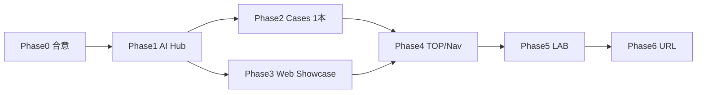

# ideal サイト体験再設計 — 実装プラン

最終更新: 2026-07-10  
設計本体: [`SITE_EXPERIENCE_REDESIGN.md`](./SITE_EXPERIENCE_REDESIGN.md)

## 方針

- **一気に全ページ作り直さない**
- **URL変更は後回し**（中身の役割とナビを先に変える）
- **既存UI資産は再配置**（モーダル・タブ・モーション・長文）
- 既に完成度の高い `/ai-capability-gallery` を DEMOS の核として活用

---

## フェーズ概要

| Phase | 目的 | 期間目安 | 成果物 |
|-------|------|----------|--------|
| **0** | 合意・ナビ仮置き | 0.5日 | 本ドキュメント確定、Header ラベル案 |
| **1** | AI を Hub 化 | 2〜4日 | `/services/ai-consulting` 再構成 |
| **2** | Cases の型を1本 | 2〜3日 | `/cases` + 建設写真整理 1本 |
| **3** | Web を体験型に | 3〜5日 | `/services/web-development` 再構成 |
| **4** | TOP / ナビ整備 | 1〜2日 | TOP導線、Header/Footer |
| **5** | LAB へ退避 | 2〜3日 | Insights 化、Philosophy 導線整理 |
| **6** | URL整理（任意） | 1〜2日 | `/demos` `/lab` 等への移行 |

---

## Phase 0 — 合意（実装前）

### やること

- [ ] [`SITE_EXPERIENCE_REDESIGN.md`](./SITE_EXPERIENCE_REDESIGN.md) の4分類・導線をチームで確認
- [ ] Phase 1〜3 の優先順位を確定（本プランどおりで進める）
- [ ] 「削除しない / 再配置する」リストを共有

### やらないこと

- 大規模なファイル削除
- 全サービスページの同時リライト

---

## Phase 1 — AI Capability Hub 化（最優先）

### 目的

説明ページだった `/services/ai-consulting` を、**デモへ誘導する Hub** にする。

### 現状

- 長文セクション多数（比較・導入理由・人材・技術提供）
- Gallery へのバナーは既にあるが、ページの主役はまだ説明

### 実装タスク

1. **Hero 差し替え**
   - コピーを Gallery と揃える（「AIで、仕事はどこまで変えられるか。」）
   - 主CTA: `/ai-capability-gallery`
   - 副CTA: `/contact?service=ai-consulting`

2. **セクション再構成（短く）**
   - 7つの業務変化（カード or Gallery へのリンク一覧）
   - 注目デモ 2〜3（Gallery アンカー or 埋め込みリンク）
   - 業界で見る（Cases 未実装時はプレースホルダ or Gallery タグへ）
   - 課題から見る（入力 / 写真 / 文書 / 繰り返し → 各デモ）
   - 開発の進め方（3ステップ程度）
   - 技術詳細（既存モーダル内容を折りたたみ or 少数残す）
   - CTA

3. **退避**
   - 「従来比較」「導入要素」「なぜ必要か」「WLB」を  
     `docs/` 下の下書き or 将来 `/lab/insights` 用 Markdown に退避メモ

### 完了条件

- AIページから2クリック以内でデモ体験に入れる
- 初画面で「触れる」が主メッセージになっている
- 旧長文がメインスクロールの大半を占めていない

### 主なファイル

- [`app/services/ai-consulting/page.tsx`](../app/services/ai-consulting/page.tsx)
- [`data/services/ai.tsx`](../data/services/ai.tsx)（必要なら分割）
- [`app/ai-capability-gallery/`](../app/ai-capability-gallery/)（リンク先）

---

## Phase 2 — Cases 型を1本作る

### 目的

「課題 → 解決フロー → デモ → 相談」の型を確立する。

### 最初の1本（確定）

**建設 × 現場写真整理**（既存「写真 → 分類」デモと直結）

### 実装タスク

1. ルート追加
   - `/cases`（一覧・仮で1件でも可）
   - `/cases/industries/construction-photo`（または `/cases/construction-photo-sorting`）

2. ページ構成
   - Hero（業界・課題名）
   - Before フロー（縦 or 横ステップ）
   - After フロー（AI介入）
   - 関連デモ CTA → `/ai-capability-gallery/photo-to-classification`
   - 相談 CTA

3. AI Hub / Gallery からリンク

### データ案

```
data/cases/
  index.ts
  construction-photo-sorting.ts
```

### 完了条件

- 記事を読んだ人がデモへ自然に進める
- 同じ型で2本目（例: 介護ケア記録 × 音声）を量産できる

### やらないこと

- 最初から全業界を揃える
- Cases に長い技術解説を入れる

---

## Phase 3 — Web ページを Interaction Showcase 化

### 目的

`/services/web-development` を「Web制作技術を体験するページ」にする。

### 実装タスク

1. **Hero**
   - 1つの印象的インタラクションに絞る（全部盛らない）
   - コピー例: 「見るだけではなく、触れたくなるWebを。」

2. **Interaction Showcase（新規）**
   - Modal / Motion / Interaction の3枠
   - 既存 [`Modal`](../components/ui/Modal.tsx) / [`PremiumDialog`](../components/motion/PremiumDialog.tsx) / タブ等を題材に「触らせる」
   - 「実装できます」と書かず、実際に使わせる

3. **What we build**
   - コーポレート / LP / 業務Web を短く

4. **Under the Hood**
   - 既存技術カード + モーダルを流用
   - モーダル本文に「このサイトのどこで使用」を追加

5. **退避**
   - 従来比較・導入啓蒙・長い「なぜ必要か」→ LAB Insights 候補リストへ

### モーション注意

- ページ全体を常時アニメーションにしない
- Showcase セクションだけ密度を上げる

### 完了条件

- Webページ訪問者が「制作技術を触った」と感じる
- 既存モーダル資産が Under the Hood で生きている

### 主なファイル

- [`app/services/web-development/page.tsx`](../app/services/web-development/page.tsx)
- [`data/services/web-development.tsx`](../data/services/web-development.tsx)
- [`data/services/modals/`](../data/services/modals/)（遅延ロード済み）
- 新規: `components/services/web/InteractionShowcase.tsx` 等

---

## Phase 4 — TOP とグローバルナビ

### 目的

入口を「触る・頼む」に寄せ、DAOを奥へ。

### 実装タスク

1. **Header**
   - `DAO研究・取り組み` → `LAB`（リンク先は当面 `/philosophy`）
   - `デモ` を追加（`/ai-capability-gallery`）
   - サービスドロップダウンは Web / AI / アプリ中心に整理（BC・Metaverse は LAB 寄せを検討）

2. **TOP**
   - TwoCard の「DAO vs IT」比重を下げる
   - Demo Gallery への強いカード/バナーを追加
   - サービスは3つ（Web / AI / Apps）に圧縮表示を検討
   - DAO は LAB への小さめ導線

3. **Footer** も同様に目的別リンクへ

### 完了条件

- 初見でデモに行ける
- Philosophy が第一導線になっていない

### 主なファイル

- [`components/layout/Header.tsx`](../components/layout/Header.tsx)
- [`components/layout/Footer.tsx`](../components/layout/Footer.tsx)
- [`app/page.tsx`](../app/page.tsx)
- [`data/services/service-links.ts`](../data/services/service-links.ts)

---

## Phase 5 — LAB への再配置

### 目的

旧長文・研究・BC/Metaverse の深掘りを LAB に集約。

### 実装タスク

1. `/lab` トップ（仮）または `/philosophy` を LAB ハブ化
2. Insights 記事化（優先候補）
   - AIと従来システムの違い
   - AI導入に必要な3要素
   - なぜ今AI導入が必要か
   - AIと働き方
3. Blockchain / Metaverse サービスページは
   - SERVICES に短い「依頼できること」を残すか
   - 詳細は LAB へ移すかを Phase 4 後に決定

### 完了条件

- 入口ページが軽く、深さは LAB で満たせる
- 旧コンテンツが404になっていない

---

## Phase 6 — URL 整理（任意・後回し）

条件: Phase 1〜4 が安定してから。

- `/ai-capability-gallery` → `/demos/ai-capability-gallery`（redirect）
- `/philosophy` → `/lab/philosophy`
- `/research` → `/lab/research`
- `/services/ai-consulting` → `/services/ai`

`next.config.ts` の redirects で対応。SEO・外部リンクを壊さない。

---

## 依存関係



Cases と Web は並列可能。AI Hub を先にすると導線が作りやすい。

---

## 既存資産の再配置マップ（実装チェックリスト）

| 資産 | 現状 | 行き先 | Phase |
|------|------|--------|-------|
| AI Gallery + ショーケース | `/ai-capability-gallery` | DEMOS 核（維持〜昇格） | 1, 4 |
| AI 長文セクション | `ai-consulting` | LAB Insights | 1, 5 |
| Web 技術モーダル | `web-development` | Under the Hood | 3 |
| ページ遷移 / HeroReveal | 全体 | 維持（待ち方最適化済み） | — |
| Philosophy / Research | `/philosophy` `/research` | LAB | 4, 5 |
| BC / Metaverse 詳細 | services 配下 | LAB + 短い依頼説明 | 5 |
| Concierge / Contact | 全体 | CTA として維持 | 全Phase |

---

## リスクと対策

| リスク | 対策 |
|--------|------|
| 範囲が広がりすぎる | Phase 1→2→3 の順を守る。6は任意 |
| 全部動いて安っぽくなる | モーション配分ルールを Phase 3 で厳守 |
| URL変更でリンク切れ | Phase 6 まで現行URL維持 |
| Cases がデモと乖離 | 必ず既存デモに紐づく1本から始める |
| LAB がゴミ置き場化 | Insights は「記事」として体裁を揃える |

---

## 直近の次アクション（実装開始時）

1. **Phase 1 着手**: `ai-consulting/page.tsx` のセクション棚卸しと Hero/導線差し替え
2. 退避する長文セクションのリストを issue / メモ化
3. Phase 2 用に Cases テンプレートのワイヤー（Before/After フロー）を1枚用意

Agent モードでの実装は、上記「Phase 1」から開始するのが最短です。
